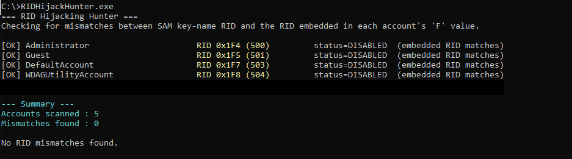
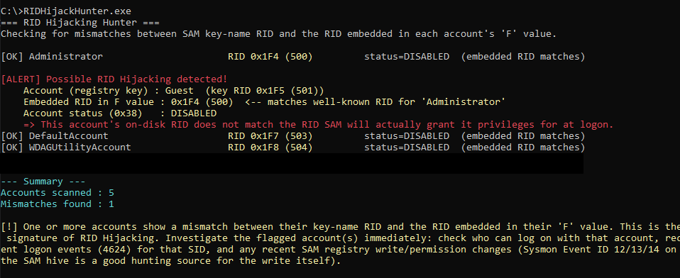

# RID Hijacking Hunter

RID Hijacking Hunter is a proof-of-concept Windows DFIR/threat hunting utility that checks for potential **RID Hijacking** by comparing:

* The RID implied by each account's registry key under the SAM database.
* The RID stored inside the account's **F** record.

If the two values differ, the tool reports the account as suspicious.

> This tool is intended for **incident response, digital forensics, and security assessment**. It is read-only and does not modify the SAM database.

---

# How it Works

Windows stores local account information inside the Security Account Manager (SAM).

For each account, this tool:

1. Opens the SAM registry hive.
2. Enumerates all account RID keys.
3. Reads the account's binary **F** value.
4. Extracts:

   * Embedded RID
   * Account status flags
5. Compares:

   * Registry key RID
   * Embedded RID inside the F value
6. Reports any mismatch.

A mismatch may indicate a RID Hijacking attack or corruption of the SAM database.

---

# Features

* Read-only operation
* Enumerates every local SAM account
* Resolves usernames through the `Users\Names` registry mapping
* Detects RID mismatches
* Reports account enabled/disabled state
* Highlights well-known RIDs:

  * 500 – Administrator
  * 501 – Guest
  * 502 – KRBTGT
  * 512 – Domain Admins

---

# Requirements

* Windows 10 / Windows 11
* Administrator privileges
* SYSTEM context (recommended)
* Visual Studio (C++17 or newer)

The tool attempts to enable:

* SeBackupPrivilege

However, access to `HKLM\SAM` typically requires the process to execute as **NT AUTHORITY\SYSTEM**.

---

## Running

This tool requires **NT AUTHORITY\SYSTEM** privileges to access the SAM registry hive.

Run the executable from a process that is already executing as **SYSTEM**. If the tool is not running in a SYSTEM context, it may be unable to open `HKLM\SAM` and will exit with an access error.


## Example Output

### Clean Scan

A clean scan shows accounts where the registry RID matches the embedded RID value. No suspicious RID mapping changes are detected.



---

### RID Hijacking Detection Alert

When a RID mismatch is detected, RIDHunter reports the affected account, the expected RID, the embedded RID value, and the account status for further investigation.




---

# Exit Codes

| Code | Meaning                             |
| ---- | ----------------------------------- |
| 0    | No RID mismatches detected          |
| 1    | Failed to access the SAM database   |
| 2    | One or more RID mismatches detected |

---

# Limitations

* Requires access to the SAM registry hive.
* The parser currently extracts only the fields required for RID comparison.
* The implementation has been tested against current Windows versions; future Windows releases may change the internal layout of SAM records.

---

# Building

Visual Studio:

```
Configuration: Release
Platform: x64
Language Standard: C++17
```

Required libraries:

* Advapi32.lib
* Netapi32.lib (if future account enumeration features are added)

---

# Detection Logic

For each account:

```
Registry Key RID
        │
        ▼
Read F value
        │
        ▼
Extract Embedded RID
        │
        ▼
Compare
        │
        ├── Equal
        │      └── OK
        │
        └── Different
               └── Possible RID Hijacking
```

---

# Disclaimer

This software is intended solely for defensive security, incident response, digital forensics, and authorized security assessments. Use only on systems for which you have explicit authorization. The authors assume no responsibility for misuse or for any damage resulting from the use of this software.
